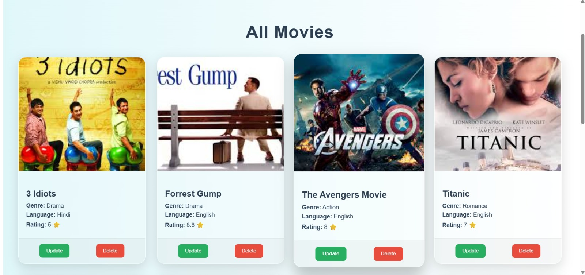
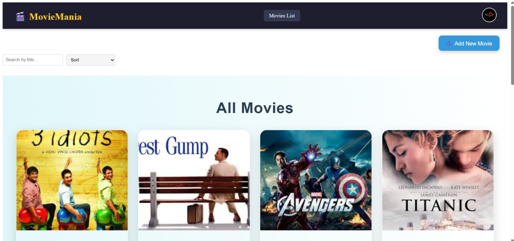

# 🎬 MERN Movie Listing App

A full-stack Movie Listing application built with the **MERN stack** (MongoDB, Express.js, React, Node.js).  
It allows users to **add**, **view**, **edit**, and **delete** movies, as well as **search** and **sort** them.

---

## 🚀 Features

- ✅ Add a new movie (title, genre, rating)
- 📝 Edit movie details
- ❌ Delete movies
- 🔍 Search movies by title
- ↕️ Sort movies by title, rating.
- 📱 Responsive UI with React
- 🌐 Deployed on Render

---

## Preview

;



## 🔗 Live Demo

## https://movies-app-dm.netlify.app/

## 📂 Project Structure

```
movie-application/
├── client/ # React frontend
│ ├── public/
│ └── src/
│ ├── components/
│ ├── pages/
│ └── App.js
├── server/ # Express backend
│ ├── controllers/
│ ├── models/
│ ├── routes/
│ └── index.js
└── README.md


```

## ⚙️ Installation & Setup (Local Development)

### Prerequisites

- Node.js (v14 or above)
- MongoDB (Atlas or local)
- Git

---

### 1. Clone the Repository

```bash
git clone https://github.com/Dipali2377/movie-application.git
cd movie-application
```
